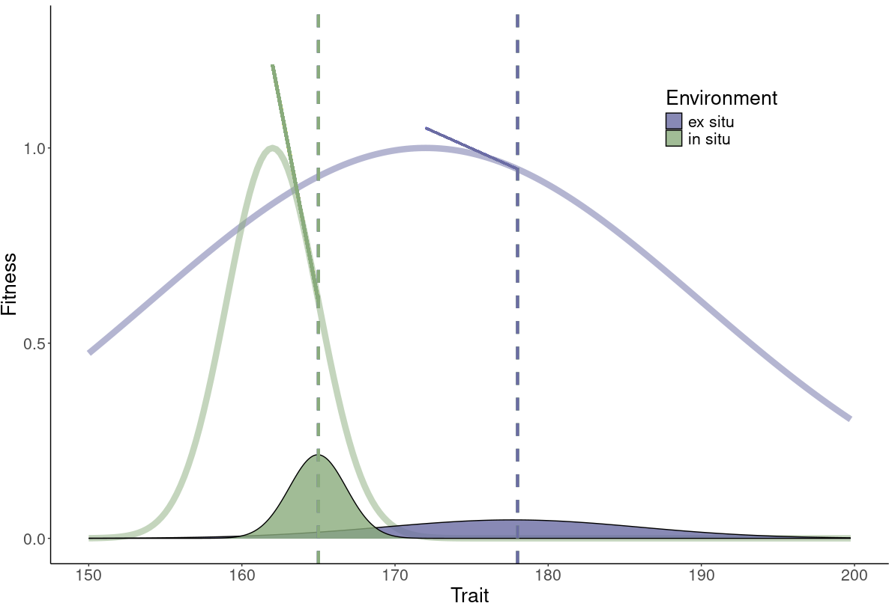

::: {.lab-hero}
::: {.hero-tags}
[Genetics]{.hero-tag .inference}
[Ecology and Conservation]{.hero-tag .ecology}
[Forensics]{.hero-tag .forensics}
:::

# Sauve Lab

::: {.subtitle}

:::
:::

---

{.centered-image}

### Welcome

The Sauve Lab is based in the Faculty of Science (Forensic Science) at **Ontario Tech University**. Broadly, I use quantitative genetics and population genetics to better understand population responses to changing environments and to solve applied problems. I get excited about the use of pedigrees, studbooks, genomics, and genealogical records, and I am beginning to explore how these tools and frameworks can extend to forensics.

::: {.section-label}
Research themes
:::

::: {.card-grid}

::: {.lab-card .ecology}
::: {.card-icon}
<svg viewBox="0 0 48 48" xmlns="http://www.w3.org/2000/svg" aria-hidden="true">
  <!-- Surface profile at three depths, peak at top center -->
  <path d="M4 38 Q 12 36, 16 32 Q 24 18, 32 32 Q 36 36, 44 38"
        fill="none" stroke="currentColor" stroke-width="1.75" stroke-linecap="round"/>
  <path d="M6 32 Q 14 30, 18 26 Q 24 12, 30 26 Q 34 30, 42 32"
        fill="none" stroke="currentColor" stroke-width="1.75" stroke-linecap="round" opacity="0.7"/>
  <path d="M9 26 Q 16 24, 19 20 Q 24 8, 29 20 Q 32 24, 39 26"
        fill="none" stroke="currentColor" stroke-width="1.75" stroke-linecap="round" opacity="0.5"/>
  <!-- Optimum -->
  <circle cx="24" cy="8" r="2" fill="currentColor"/>
</svg>
:::
### Ecology and Conservation
I study zoological collections and wildlife populations to better understand contemporary responses to environmental change.
:::

::: {.lab-card .inference}
::: {.card-icon}
<svg viewBox="0 0 48 48" xmlns="http://www.w3.org/2000/svg" aria-hidden="true">
  <!-- Generation 1: father (square), mother (circle) -->
  <rect x="8" y="6" width="9" height="9" fill="none" stroke="currentColor" stroke-width="2"/>
  <circle cx="35" cy="10.5" r="4.5" fill="none" stroke="currentColor" stroke-width="2"/>
  <!-- Mating line + drop -->
  <line x1="17" y1="10.5" x2="30.5" y2="10.5" stroke="currentColor" stroke-width="2"/>
  <line x1="24" y1="10.5" x2="24" y2="24" stroke="currentColor" stroke-width="2"/>
  <!-- Sibship line -->
  <line x1="10" y1="24" x2="38" y2="24" stroke="currentColor" stroke-width="2"/>
  <line x1="10" y1="24" x2="10" y2="30" stroke="currentColor" stroke-width="2"/>
  <line x1="24" y1="24" x2="24" y2="30" stroke="currentColor" stroke-width="2"/>
  <line x1="38" y1="24" x2="38" y2="30" stroke="currentColor" stroke-width="2"/>
  <!-- Generation 2: daughter, son, daughter -->
  <circle cx="10" cy="34.5" r="4.5" fill="none" stroke="currentColor" stroke-width="2"/>
  <rect x="19.5" y="30" width="9" height="9" fill="none" stroke="currentColor" stroke-width="2"/>
  <circle cx="38" cy="34.5" r="4.5" fill="none" stroke="currentColor" stroke-width="2"/>
</svg>
:::
### Genetics
I use sequencing and relatedness to study evolutionary processes.
:::

::: {.lab-card .forensics}
::: {.card-icon}
<svg viewBox="0 0 48 48" xmlns="http://www.w3.org/2000/svg" aria-hidden="true">
  <!-- Strand 1 -->
  <path d="M14 4 C 14 9, 34 9, 34 14 C 34 19, 14 19, 14 24 C 14 29, 34 29, 34 34 C 34 39, 14 39, 14 44"
        fill="none" stroke="currentColor" stroke-width="2.25" stroke-linecap="round"/>
  <!-- Strand 2 -->
  <path d="M34 4 C 34 9, 14 9, 14 14 C 14 19, 34 19, 34 24 C 34 29, 14 29, 14 34 C 14 39, 34 39, 34 44"
        fill="none" stroke="currentColor" stroke-width="2.25" stroke-linecap="round"/>
  <!-- Base pairs -->
  <line x1="14" y1="14" x2="34" y2="14" stroke="currentColor" stroke-width="1.5"/>
  <line x1="14" y1="24" x2="34" y2="24" stroke="currentColor" stroke-width="1.5"/>
  <line x1="14" y1="34" x2="34" y2="34" stroke="currentColor" stroke-width="1.5"/>
</svg>
:::
### Forensics
I am interested in understanding how genetics and statistical tools from evolutionary ecology might be applied in forensic contexts.
:::

:::

::: {.section-label}
Lab at a glance
:::

::: {.stat-strip}
::: {.stat-item}
[35]{.stat-num}
[Pedigrees Analyzed]{.stat-label}
:::
::: {.stat-item}
[3]{.stat-num}
[Team Members]{.stat-label}
:::
::: {.stat-item}
[16]{.stat-num}
[Publications]{.stat-label}
:::
::: {.stat-item}
[2026]{.stat-num}
[Founded]{.stat-label}
:::
:::

::: {.join-callout}
### Interested in joining the lab?

We welcome motivated students and postdocs interested in evolutionary genetics, conservation,
and quantitative biology.

[See open positions →](join.qmd){.btn-amber}
:::
