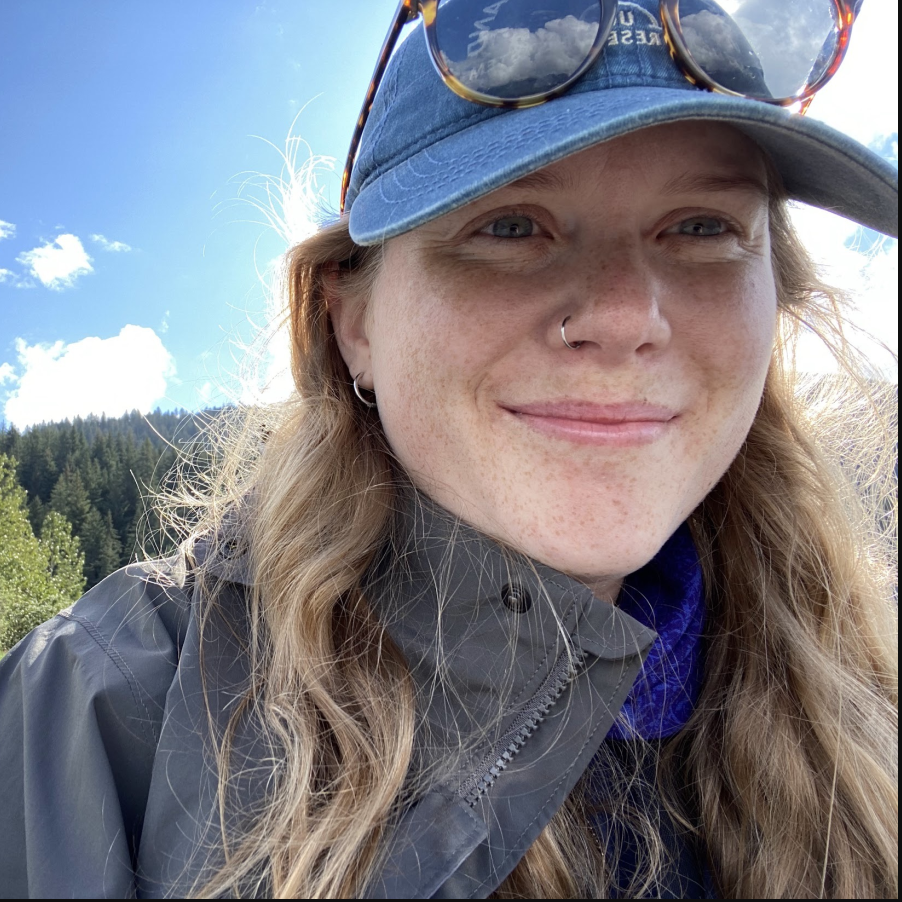
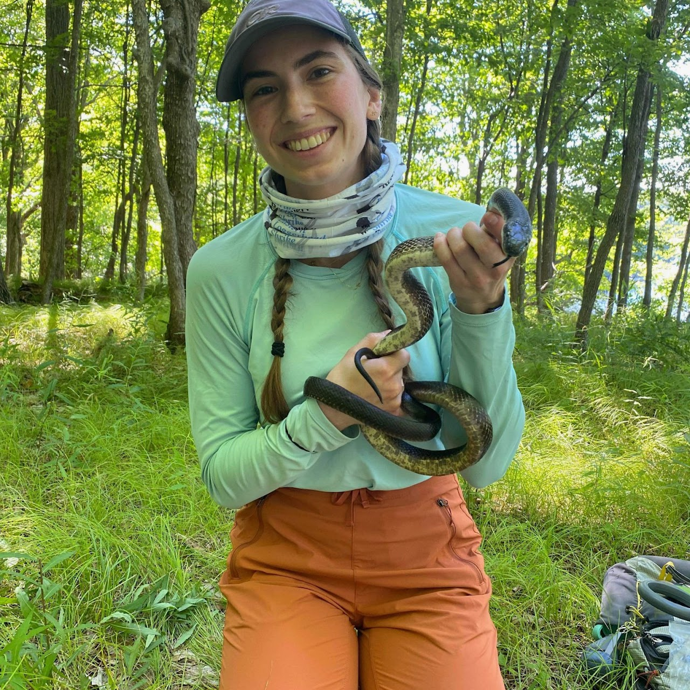

::: {.section-label}
Principal Investigator
:::

::: {.team-grid}
::: {.team-card}

::: {.member-name}
Dr. Drew Sauve
:::
::: {.member-role}
Principal Investigator
:::

Assistant Professor, Faculty of Science - Forensic Science  
Ontario Tech University

::: {.member-links}
[CV](files/CV.pdf) · [Email](mailto:lab@ontariotechu.ca) · [Google Scholar](https://scholar.google.com/citations?user=W49QJVcAAAAJ&hl=en)
:::
:::
:::

**Dr. Drew Sauve** is an Assistant Professor in the Faculty of Science (Forensic Science) at Ontario Tech University. His research uses quantitative genetics and statistical modeling to understand how organisms change phenotypes through evolution and plasticity. His work has focused on climate change and conservation applications, and he is beginning to explore how population genetic frameworks can address forensic questions.

---

::: {.section-label}
Postdoctoral Researchers
:::

::: {.team-grid}
::: {.team-card}

::: {.member-name}
Dr. Aly Van Natto
:::
::: {.member-role}
MITACs Postdoctoral Fellow

Co-supervised by [Dr. Vicki Friesen](https://www.friesenlab.ca/) & [Dr. Amy Chabot](https://lionsafari.com/)
:::
Genomic approaches to zoo population management: simulation-informed
sampling strategies and wild–ex situ genomic comparisons

::: {.member-links}
[Email](17avn2@queensu.ca) · [Google Scholar](https://scholar.google.com/citations?user=WMmqPXIAAAAJ&hl=en)
:::
:::
:::

---

::: {.section-label}
Graduate Students
:::

::: {.team-grid}
::: {.team-card}

::: {.member-name}
Hana Thompson
:::
::: {.member-role}
PhD Candidate

Co-supervised by [Dr. Michelle DiLeo](https://michelledileo.wordpress.com/)
:::
What do genetic diversity indicators tell us about the adaptive potential of populations?

PhD in progress · expected 2029

::: {.member-links}
[Email](hanathompson@trentu.ca) · [Google Scholar](https://scholar.google.com/citations?user=OXfV2_EAAAAJ&hl=en) · [Website](https://hanathompson.owlstown.net/)
:::
:::

:::

---

::: {.section-label}
Undergraduate Students
:::

---

::: {.section-label}
Alumni
:::

| Name | Degree | Year | Current position |
|------|--------|------|-----------------|
| Former Student | MSc | 2023 | Position at Institution |
| Former Student | BSc Honours | 2022 | Position at Institution |

---

